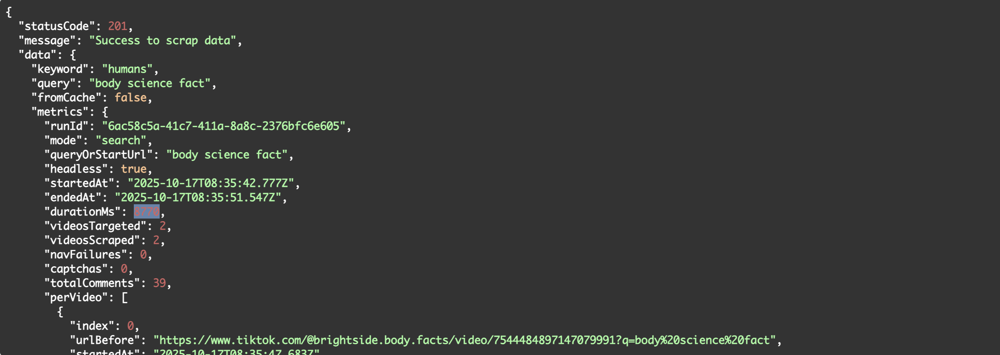

## Overview

**TikTok Data Watchers** is a real-time backend service designed to **scrape, filter, analyze, and cache TikTok content** to provide actionable insights about how people talk about specific brands, topics, or keywords.

This project aims to help **marketers, analysts, and researchers** monitor public sentiment and discover trends on TikTok through automated ingestion of videos and their comments.

The system:
1. Searches TikTok by a keyword or phrase.  
2. Opens and scrapes an unlimited sequence of videos.  
3. Extracts structured information (title, caption, username, comments).  
4. Filters content by a **target keyword** (brand/topic).  
5. Stores full results in **LRU Cache** to avoid redundant scraping.  
6. Returns rich analytical metadata for each session.

---

## Key Features
- **Unlimited TikTok video scraping** by search query.  
- Keyword matching across captions, titles, and comments.  
- Comment extraction with author username.  
- Built-in scraping metrics and analytics.  
- LRU cache for ultra-fast repeat queries.  
- Graceful browser handling (no zombie Chrome).  
- Stealth scraping for reduced detection.  

---

## Tech Stack
- [NestJS](https://nestjs.com/) – backend framework  
- [Puppeteer Extra + Stealth Plugin](https://github.com/berstend/puppeteer-extra) – TikTok scraping  
- LRU Cache – caching layer  
- TypeScript, Node.js

---

## Environment Variables

Create a `.env` file at the project root:

```env
# APP
APP_NAME="Tiktok Data Watchers"
PORT="3030"
NODE_ENV="development" # "development" || "production"
PREFIX_NAME="api"

# JWT
JWT_EXPIRATION="1h"

# PUPPETEER
HEADLESS="1" # "1" || "0"
KEEP_BROWSER_OPEN="0" # "1" || "0"

# LRU
SCRAPER_CACHE_TTL_MS=600000
SCRAPER_CACHE_MAX_ENTRIES=500
```

🧭 Puppeteer Config
HEADLESS=1 runs Chrome in headless mode (no UI), 0 runs in visible mode (useful during development).
KEEP_BROWSER_OPEN=1 keeps the browser open after scraping for debugging.

🪣 LRU Config
SCRAPER_CACHE_TTL_MS sets how long (in ms) a cached scraping session lives.
SCRAPER_CACHE_MAX_ENTRIES controls the maximum number of cache entries stored in memory.


---

## Getting Started

1. Clone & Install
```
git clone https://github.com/your-org/tiktok-data-watchers.git
cd tiktok-data-watchers
```
npm install
2. Run in Development
```npm run start:dev```
3. Build & Run in Production
```
npm run build
npm run start:prod // use swagger to see the UI API at path /api/docs
``` 

---

## API Endpoints

1. POST /tiktok-scraper → scrapeAnnotateAndCache
Starts a scraping session, applies keyword filtering, and caches the result.

📨 Request Body
```
{
  "search": "science fact",
  "keyword": "body",
  "max": 20,
  "showVideoOnlyWithMatchKeyword": true // Optional. If true, only videos with keyword returned
  "forceRefresh": false // Optional. Set to true to reset the cache
}
```

---

## LRU Cache Behavior
- Cache key = search+max
- Cache stores the full scrape session (video + comment data).
- If the same query is requested again:
- It pulls from cache (no TikTok scraping).
- If keyword differs, filtering runs on the cached data.
- Controlled by TTL and max entries from .env.

---

## Example Response




## ⚡ Performance & Scalability

This section provides a rough estimation of how many TikTok videos the **Tiktok Data Watchers** can process per day under different conditions, based on real scraping metrics.

---

Baseline Performance, this includes metadata extraction, comment scraping, and navigation overhead using Puppeteer.
- **Test batch:** 10 videos  
- **Comments per video:** 20  
- **Total time:** 41 seconds  
- **Average time per video:** ~4.1 seconds  

---

Estimated Daily Throughput (1 Worker)

| Mode                     | Avg Time / Video | Videos / Hour | Videos / Day |
|---------------------------|-------------------|---------------|-------------|
| 🟢 **Optimistic** (ideal network)     | 1.2 s             | ~3,000        | ~72,000     |
| 🟡 **Realistic** (typical prod)       | 4.1 s             | ~878          | ~21,073     |
| 🟠 **Conservative** (heavy load)     | 5.5 s             | ~655          | ~15,700     |

> 📝 *Note*: These are rough calculations based on 86,400 seconds in a day.  
> Real-world performance will vary depending on network stability, TikTok response times, and Puppeteer settings.

---

Factors Affecting Performance

- **Network & latency** — slower page loads increase total scrape time.  
- **TikTok anti-bot detection** — may introduce delays or blocks.  
- **Comment fetching** — comments are lazy-loaded and add extra overhead.  
- **Headless vs non-headless** — headless mode typically performs faster.  
- **Retry & backoff** — error handling can extend total processing time.

---

## Graceful Shutdown
- Chrome tab is automatically closed after scraping finishes.
- Set KEEP_BROWSER_OPEN=1 for debugging to keep it open manually.
- The service ensures no zombie processes remain.